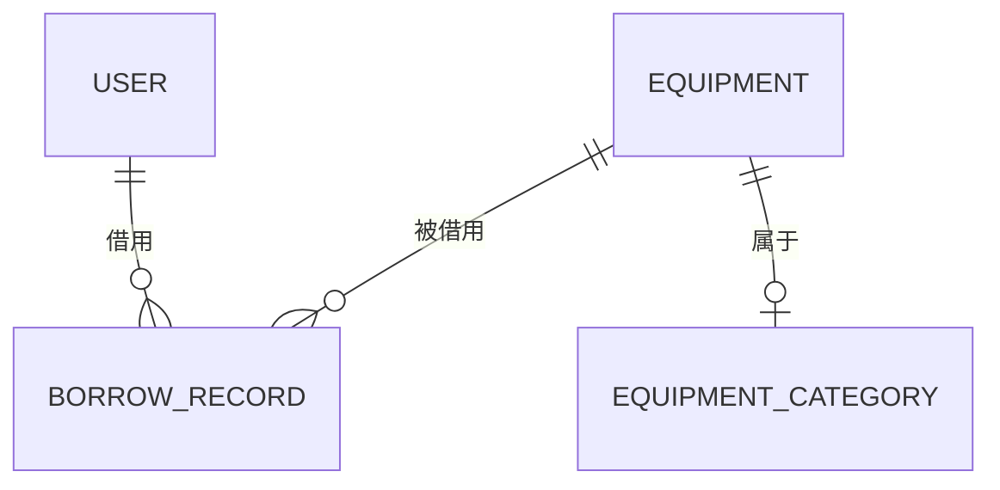

# 03 - 数据库设计

> 本章演示如何使用 lnngfar entity 命令自动生成数据库表和后端代码。

---

## 场景描述

架构师需要根据需求规格说明书设计数据库：
1. 定义实体及其关系
2. 生成 MyBatis Plus 实体类
3. 自动生成 Mapper、Service、Controller
4. 生成数据库脚本

---

## 使用 lnngfar entity

### 步骤 1：导入需求规格

```bash
# 将需求规格文档复制到 specs 目录
$ cp 公司设备管理系统需求.md specs/03-需求规格说明书.md

# lnngfar spec 会解析规格文档，提取实体信息
$ lnngfar spec parse specs/03-需求规格说明书.md

✓ 解析完成！识别到以下实体：
  - User (用户)
  - Department (部门)
  - Role (角色)
  - Equipment (设备)
  - EquipmentCategory (设备分类)
  - BorrowRecord (借用记录)
  - RepairRecord (维修记录)

✓ 已更新 .ai/module-map.md
✓ 已更新 specs/02-数据库设计.md
```

### 步骤 2：定义实体（交互式）

```bash
# 创建设备实体
$ lnngfar entity create equipment

? 实体名称: equipment
? 实体描述: 设备档案
? 是否启用缓存: No
? 是否启用逻辑删除: Yes

? 添加字段 (按 Enter 跳过):
  ? 字段名: code
  ? 字段类型: String
  ? 字段长度: 50
  ? 是否必填: Yes
  ? 默认值: (无)
  ? 字段注释: 设备编号
  ✓ 字段添加成功

  ? 添加字段:
  ? 字段名: name
  ? 字段类型: String
  ? 字段长度: 100
  ? 是否必填: Yes
  ? 字段注释: 设备名称

  ? 添加字段:
  ? 字段名: categoryId
  ? 字段类型: Long
  ? 是否必填: Yes
  ? 字段注释: 分类ID

  ? 添加字段:
  ? 字段名: model
  ? 字段类型: String
  ? 字段长度: 100
  ? 字段注释: 型号规格

  ? 添加字段:
  ? 字段名: price
  ? 字段类型: BigDecimal
  ? 字段注释: 购置价格

  ? 添加字段:
  ? 字段名: buyDate
  ? 字段类型: LocalDate
  ? 字段注释: 购置日期

  ? 添加字段:
  ? 字段名: status
  ? 字段类型: Integer
  ? 默认值: 0
  ? 字段注释: 状态 0空闲 1使用中 2维修中 3报废 4闲置

  ? 添加字段:
  ? 字段名: location
  ? 字段类型: String
  ? 字段长度: 100
  ? 字段注释: 存放位置

  ? 添加字段: (按 Enter 跳过)

✓ 实体定义完成！

? 是否添加关联关系:
  ? 与 categoryId 关联到: equipment_category
  ? 关联类型: ManyToOne
  ✓ 关联添加成功

? 是否生成 CRUD API: Yes
✓ 正在生成代码...
```

### 步骤 3：批量创建其他实体

```bash
# 使用 JDL-like 语法批量创建
$ lnngfar entity batch -f << 'EOF'
entity user {
  username String(50) required unique
  password String(100) required
  realName String(50)
  email String(100)
  phone String(20)
  deptId Long
  status Integer default(1)
  -> department
}

entity department {
  name String(50) required
  parentId Long
  sort Integer default(0)
  -> department parent
}

entity borrow_record {
  equipmentId Long required -> equipment
  userId Long required -> user
  borrowDate DateTime required
  expectReturn DateTime required
  actualReturn DateTime
  status Integer required
  purpose String(500)
  approverId Long
  approveTime DateTime
  remark String(500)
}
EOF

✓ 实体 user 已创建
✓ 实体 department 已创建
✓ 实体 borrow_record 已创建
```

### 步骤 4：生成代码

```bash
# 生成所有实体的完整代码
$ lnngfar entity generate --all

✓ 生成完成！

backend/src/main/java/com/company/equipment/
├── module/equipment/
│   ├── entity/
│   │   └── Equipment.java
│   ├── mapper/
│   │   └── EquipmentMapper.java
│   ├── service/
│   │   ├── EquipmentService.java
│   │   └── impl/
│   │       └── EquipmentServiceImpl.java
│   ├── controller/
│   │   └── EquipmentController.java
│   └── dto/
│       ├── EquipmentCreateDTO.java
│       ├── EquipmentUpdateDTO.java
│       └── EquipmentVO.java
│
├── module/user/
│   └── ...
│
├── module/borrow/
│   └── ...
│
└── common/
    ├── result/
    │   ├── Result.java
    │   └── ResultCode.java
    ├── exception/
    │   ├── BusinessException.java
    │   └── GlobalExceptionHandler.java
    └── mybatis/
        └── BaseEntity.java

✓ 数据库脚本已生成: backend/src/main/resources/sql/equipment-2026-05-10.sql
```

---

## 生成的代码示例

### Entity 实体类

```java
// backend/src/main/java/com/company/equipment/module/equipment/entity/Equipment.java
package com.company.equipment.module.equipment.entity;

import com.baomidou.mybatisplus.annotation.*;
import com.company.equipment.common.mybatis.BaseEntity;
import lombok.Data;
import lombok.EqualsAndHashCode;
import java.math.BigDecimal;
import java.time.LocalDate;

@Data
@EqualsAndHashCode(callSuper = true)
@TableName("equipment")
public class Equipment extends BaseEntity {
    
    /** 设备编号 */
    @TableField("code")
    private String code;
    
    /** 设备名称 */
    @TableField("name")
    private String name;
    
    /** 分类ID */
    @TableField("category_id")
    private Long categoryId;
    
    /** 型号规格 */
    @TableField("model")
    private String model;
    
    /** 购置价格 */
    @TableField("price")
    private BigDecimal price;
    
    /** 购置日期 */
    @TableField("buy_date")
    private LocalDate buyDate;
    
    /** 状态：0空闲 1使用中 2维修中 3报废 4闲置 */
    @TableField("status")
    private Integer status;
    
    /** 存放位置 */
    @TableField("location")
    private String location;
    
    /** 保管人ID */
    @TableField("keeper_id")
    private Long keeperId;
    
    /** 归属部门ID */
    @TableField("dept_id")
    private Long deptId;
    
    /** 二维码 */
    @TableField("qr_code")
    private String qrCode;
    
    /** 备注 */
    @TableField("remark")
    private String remark;
}
```

### Controller

```java
// backend/src/main/java/com/company/equipment/module/equipment/controller/EquipmentController.java
package com.company.equipment.module.equipment.controller;

import com.company.equipment.common.result.Result;
import com.company.equipment.module.equipment.dto.*;
import com.company.equipment.module.equipment.service.EquipmentService;
import lombok.RequiredArgsConstructor;
import org.springframework.web.bind.annotation.*;
import jakarta.validation.Valid;

@RestController
@RequestMapping("/api/equipment")
@RequiredArgsConstructor
public class EquipmentController {
    
    private final EquipmentService equipmentService;
    
    /**
     * 分页查询设备
     */
    @GetMapping("/page")
    public Result<Page<EquipmentVO>> page(EquipmentPageQuery query) {
        return Result.success(equipmentService.page(query));
    }
    
    /**
     * 根据ID查询设备
     */
    @GetMapping("/{id}")
    public Result<EquipmentVO> getById(@PathVariable Long id) {
        return Result.success(equipmentService.getById(id));
    }
    
    /**
     * 创建设备
     */
    @PostMapping
    public Result<Long> create(@Valid @RequestBody EquipmentCreateDTO dto) {
        return Result.success(equipmentService.create(dto));
    }
    
    /**
     * 更新设备
     */
    @PutMapping("/{id}")
    public Result<Void> update(@PathVariable Long id, 
                               @Valid @RequestBody EquipmentUpdateDTO dto) {
        equipmentService.update(id, dto);
        return Result.success();
    }
    
    /**
     * 删除设备
     */
    @DeleteMapping("/{id}")
    public Result<Void> delete(@PathVariable Long id) {
        equipmentService.delete(id);
        return Result.success();
    }
    
    /**
     * 导出设备列表
     */
    @GetMapping("/export")
    public void export(EquipmentPageQuery query, HttpServletResponse response) {
        equipmentService.export(query, response);
    }
}
```

### Service 接口

```java
// backend/src/main/java/com/company/equipment/module/equipment/service/EquipmentService.java
package com.company.equipment.module.equipment.service;

import com.baomidou.mybatisplus.extension.plugins.pagination.Page;
import com.baomidou.mybatisplus.extension.service.IService;
import com.company.equipment.module.equipment.dto.*;
import jakarta.servlet.http.HttpServletResponse;

public interface EquipmentService extends IService<Equipment> {
    
    /**
     * 分页查询
     */
    Page<EquipmentVO> page(EquipmentPageQuery query);
    
    /**
     * 根据ID查询详情
     */
    EquipmentVO getById(Long id);
    
    /**
     * 创建设备
     */
    Long create(EquipmentCreateDTO dto);
    
    /**
     * 更新设备
     */
    void update(Long id, EquipmentUpdateDTO dto);
    
    /**
     * 删除设备
     */
    void delete(Long id);
    
    /**
     * 导出设备列表
     */
    void export(EquipmentPageQuery query, HttpServletResponse response);
}
```

---

## 数据库脚本

```sql
-- backend/src/main/resources/sql/equipment-2026-05-10.sql

-- 设备分类表
CREATE TABLE equipment_category (
    id BIGINT NOT NULL AUTO_INCREMENT COMMENT '主键',
    name VARCHAR(50) NOT NULL COMMENT '分类名称',
    parent_id BIGINT COMMENT '父分类ID',
    icon VARCHAR(100) COMMENT '图标',
    sort INT DEFAULT 0 COMMENT '排序',
    create_time DATETIME DEFAULT CURRENT_TIMESTAMP,
    update_time DATETIME DEFAULT CURRENT_TIMESTAMP ON UPDATE CURRENT_TIMESTAMP,
    PRIMARY KEY (id),
    KEY idx_parent_id (parent_id)
) ENGINE=InnoDB DEFAULT CHARSET=utf8mb4 COMMENT='设备分类表';

-- 设备表
CREATE TABLE equipment (
    id BIGINT NOT NULL AUTO_INCREMENT COMMENT '主键',
    code VARCHAR(50) NOT NULL COMMENT '设备编号',
    name VARCHAR(100) NOT NULL COMMENT '设备名称',
    category_id BIGINT NOT NULL COMMENT '分类ID',
    model VARCHAR(100) COMMENT '型号规格',
    price DECIMAL(10,2) COMMENT '购置价格',
    buy_date DATE COMMENT '购置日期',
    status TINYINT DEFAULT 0 COMMENT '状态 0空闲 1使用中 2维修中 3报废 4闲置',
    location VARCHAR(100) COMMENT '存放位置',
    keeper_id BIGINT COMMENT '保管人ID',
    dept_id BIGINT COMMENT '归属部门ID',
    qr_code VARCHAR(200) COMMENT '二维码',
    remark TEXT COMMENT '备注',
    create_time DATETIME DEFAULT CURRENT_TIMESTAMP,
    update_time DATETIME DEFAULT CURRENT_TIMESTAMP ON UPDATE CURRENT_TIMESTAMP,
    del_flag TINYINT DEFAULT 0 COMMENT '删除标记',
    PRIMARY KEY (id),
    UNIQUE KEY uk_code (code),
    KEY idx_category_id (category_id),
    KEY idx_status (status),
    KEY idx_dept_id (dept_id)
) ENGINE=InnoDB DEFAULT CHARSET=utf8mb4 COMMENT='设备表';

-- 借用记录表
CREATE TABLE borrow_record (
    id BIGINT NOT NULL AUTO_INCREMENT COMMENT '主键',
    equipment_id BIGINT NOT NULL COMMENT '设备ID',
    user_id BIGINT NOT NULL COMMENT '借用人ID',
    borrow_date DATETIME NOT NULL COMMENT '借用时间',
    expect_return DATETIME NOT NULL COMMENT '预计归还时间',
    actual_return DATETIME COMMENT '实际归还时间',
    status TINYINT NOT NULL COMMENT '状态 0待审批 1已通过 2已拒绝 3使用中 4已归还 5已超期',
    purpose VARCHAR(500) COMMENT '借用用途',
    approver_id BIGINT COMMENT '审批人ID',
    approve_time DATETIME COMMENT '审批时间',
    remark VARCHAR(500) COMMENT '备注',
    create_time DATETIME DEFAULT CURRENT_TIMESTAMP,
    update_time DATETIME DEFAULT CURRENT_TIMESTAMP ON UPDATE CURRENT_TIMESTAMP,
    PRIMARY KEY (id),
    KEY idx_equipment_id (equipment_id),
    KEY idx_user_id (user_id),
    KEY idx_status (status)
) ENGINE=InnoDB DEFAULT CHARSET=utf8mb4 COMMENT='借用记录表';
```

---

## lnngfar entity 功能需求清单

通过这个案例，**lnngfar entity** 需要具备以下能力：

### 核心能力

| 能力 | 说明 | 实现方式 |
|------|------|----------|
| **实体定义** | 支持交互式定义实体和字段 | Inquirer.js |
| **JDL 支持** | 支持类似 JHipster JDL 的语法 | 自定义解析器 |
| **代码生成** | 生成 Entity/Mapper/Service/Controller | Template Engine |
| **DTO 生成** | 自动生成 Create/Update/Query/VO DTO | Template Engine |
| **SQL 生成** | 生成 MySQL/PostgreSQL 建表脚本 | 模板生成 |
| **关联关系** | 支持 OneToOne/OneToMany/ManyToMany | 注解配置 |

### 字段类型支持

| 前端类型 | 后端类型 | 数据库类型 |
|----------|----------|------------|
| String | String | VARCHAR |
| Integer | Integer | INT |
| Long | Long | BIGINT |
| BigDecimal | BigDecimal | DECIMAL |
| Boolean | Boolean | TINYINT |
| LocalDate | LocalDate | DATE |
| LocalDateTime | LocalDateTime | DATETIME |
| Date | Date | DATETIME |
| Text | String | TEXT |
| Json | String | JSON |

### 生成选项

| 选项 | 说明 |
|------|------|
| `--all` | 生成所有已定义实体 |
| `--module <name>` | 只生成指定模块 |
| `--skip-service` | 跳过 Service 层 |
| `--skip-controller` | 跳过 Controller 层 |
| `--with-sql` | 生成 SQL 脚本 |
| `--with-test` | 生成单元测试 |

---

## AI 上下文更新

lnngfar 会自动更新 AI 上下文：

```markdown
<!-- .ai/module-map.md -->

# 模块地图

## 模块列表

| 模块名 | 中文名 | 实体数 | 状态 |
|--------|--------|--------|------|
| system | 系统管理 | 5 | 已生成 |
| equipment | 设备管理 | 2 | 已生成 |
| borrow | 借用管理 | 1 | 待开发 |
| repair | 维修管理 | 1 | 待开发 |

## 实体关系


```

---

## 下一步

接下来演示：
1. 如何使用 **lnngfar backend** 开发后端 API
2. 如何使用 **lnngfar ai** 辅助编写业务逻辑
